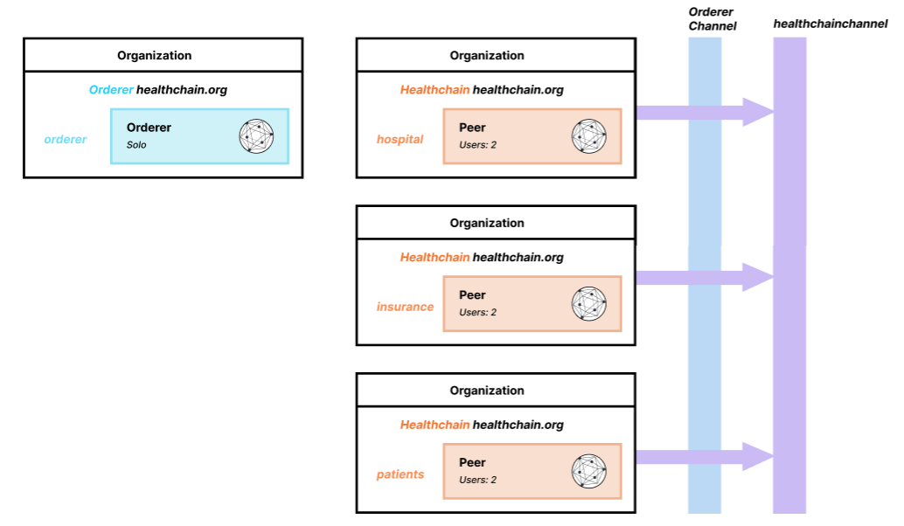

# Healthchain-Fabric

Problem Statement: The current healthcare system faces several challenges related to data integrity, interoperability, and patient privacy. Traditional healthcare databases are isolated, making it difficult to share patient information securely and efficiently among different stakeholders. Moreover, the lack of transparency in healthcare transactions leads to inefficiencies, fraud, and disputes.

Solution: A Hyperledger Fabric-based healthcare data management platform where healthcare providers, insurers, and patients can securely store and share medical records.

Organizations Involved

    Hospitals:
        This includes various healthcare providers such as clinics, hospitals, and medical centers.
        They are responsible for creating and updating patient medical records.

    Insurance Companies:
        These are companies that provide health insurance coverage to patients.
        They need access to patient records to verify claims and approve treatments.

    Patients:
        Individuals receiving healthcare services.
        They have control over their medical data and can grant or revoke access to their records.

How It Works

    Data Privacy and Security:
        Using Hyperledger Fabric ensures that data is secure and only accessible to authorized parties.
        Each organization (Hospitals, Insurance, Patients) has its own peers (servers) that hold a copy of the shared ledger (database).

    The Shared Channel (healthchain-channel):
        All three organizations communicate and share data through this single channel.
        This channel contains the blockchain ledger where all transactions and data exchanges are recorded.

    Smart Contracts (Chaincode):
        Smart contracts are automated agreements written in code, defining the rules for data access and transactions.
        For example, a smart contract can automate the process of a hospital updating a patient's record and an insurance company accessing that record to process a claim.

    Consensus Mechanism:
        Hyperledger Fabric's orderer nodes ensure that all data transactions are recorded in a consistent and tamper-proof manner across the network.
        This ensures that all parties have a synchronized and accurate view of the data.

Example Scenarios

    Patient Visits a Hospital:
        A patient visits a hospital, and the hospital updates their medical record on the blockchain.
        This update is visible to the patient and, if permitted, to their insurance company.

    Insurance Claim Processing:
        After the patient's visit, the hospital submits a treatment record to the insurance company via the blockchain.
        The insurance company verifies the record and processes the claim based on the shared data.

    Patient Data Access:
        Patients can view their medical records and grant access to new healthcare providers or revoke access if they change insurance companies or hospitals.

Benefits of Your System

    Improved Data Security: Blockchain technology ensures that patient data is securely stored and only accessible to authorized parties.
    Enhanced Data Sharing: Hospitals, insurance companies, and patients can seamlessly share and update medical records, improving efficiency and reducing errors.
    Patient Control: Patients have more control over their own healthcare data, knowing who has access and for what purposes.
    Transparency and Trust: Blockchain's immutable ledger provides a transparent record of all transactions, enhancing trust among all parties involved.

Technical Setup

    Certificate Authorities (CA):
        Each organization has its own CA to issue digital certificates, ensuring secure identity management for participants.

    Peers and Orderer Nodes:
        Each organization runs peer nodes that hold copies of the ledger and endorse transactions.
        Orderer nodes manage the ordering and validation of transactions across the network.

    Deploying the Network:
        The network configuration, including channel creation and smart contract deployment, is set up using tools provided by Hyperledger Fabric.

Conclusion

You're creating a sophisticated healthcare management system that leverages blockchain technology to securely and efficiently manage healthcare data among hospitals, insurance companies, and patients. This system aims to improve data security, streamline data sharing, and give patients greater control over their personal health information.

Workflow

    Patient Visits Hospital:
        When a patient visits a hospital, the hospital creates or updates the patient’s medical record on the blockchain.
        This record includes diagnosis, treatments, and other relevant medical information.

    Insurance Claim Submission:
        After treatment, the hospital submits a claim to the insurance company through the blockchain.
        The claim includes treatment details and costs, along with the patient’s medical records relevant to the claim.

    Claim Verification and Processing:
        The insurance company accesses the submitted claim and patient records on the blockchain.
        They verify the information, approve or deny the claim, and process payment if approved.
        The status of the claim (approved/denied) is updated on the blockchain, visible to both the hospital and the patient.

    Patient Consent and Control:
        Patients have the ability to control who can access their medical records.
        They can provide or revoke consent for hospitals and insurance companies to view their data.

How Claims and Payments Work
1. Medical Treatment and Record Update

    Hospital: When a patient receives treatment at a hospital, the hospital updates the patient's medical record on the blockchain. This record includes details such as diagnosis, procedures performed, and any prescribed medications.

2. Insurance Claim Submission

    Hospital: After providing medical services, the hospital creates an insurance claim. This claim is a formal request for reimbursement for the costs associated with the patient's treatment.
    The claim is submitted on the blockchain channel (healthchain-channel), which includes:
        Patient's medical details relevant to the claim.
        Itemized list of services rendered and their costs.
        Any supporting documents or evidence (e.g., lab results, doctor's notes).

3. Claim Verification and Processing

    Insurance Company: The insurance company accesses the claim and associated medical records on the blockchain.
    They verify the authenticity and accuracy of the claim by checking:
        The validity of the medical services provided.
        The patient’s insurance coverage and policy details.
        Any pre-existing conditions or exclusions that might affect coverage.
    After verification, the insurance company makes a decision:
        Approve: The claim is valid, and the insurance company agrees to pay the hospital.
        Deny: The claim is invalid or not covered under the patient’s insurance policy. Reasons for denial are documented and shared on the blockchain.

4. Processing Payment

    Insurance Company: If the claim is approved, the insurance company processes the payment.
    Payment details are recorded on the blockchain, ensuring transparency and traceability.
    The insurance company transfers the approved amount to the hospital’s account.
    Update on Blockchain: The payment transaction and status of the claim (approved/paid) are updated on the blockchain ledger. This update is visible to both the hospital and the patient.

5. Patient Notification

    Patient: The patient is notified of the claim status (approved/denied) and any remaining balance they may be responsible for paying out-of-pocket.
    Patients can view the status and details of claims and payments on the blockchain.

Example Workflow

    Patient Visits Hospital:
        John Doe visits a hospital and receives treatment for a medical condition.
        The hospital updates John’s medical record on the blockchain with treatment details.

    Hospital Submits Claim:
        The hospital submits a claim to John’s insurance company through the blockchain, detailing the services provided and their costs.

    Insurance Company Reviews Claim:
        The insurance company accesses the claim and verifies it against John’s insurance policy.
        After verification, the claim is approved.

    Payment Processing:
        The insurance company processes the payment and transfers funds to the hospital.
        The transaction is recorded on the blockchain, updating the claim status to "paid".

    Patient Notification:
        John is notified that his claim has been processed and approved.
        He can see the claim details and payment status on the blockchain, ensuring transparency.